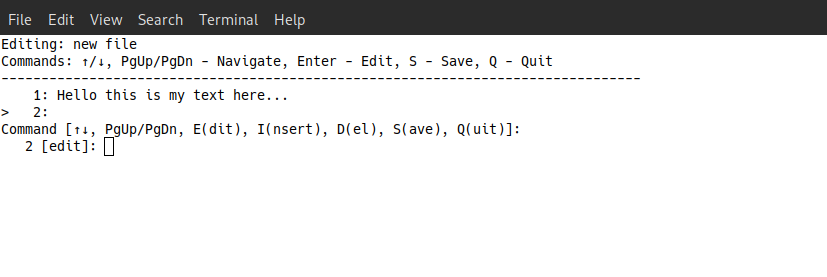

# PyLine - Lightweight Terminal Text Editor

 

PyLine is a minimalist command-line text editor designed for Linux/BSD systems, written in Python 3 with use of systems calls. Originally created in 2018 and modernized in 2025, it combines improved text management with a simple, line-by-line workflow. 
(*Note: This is a hobby project, not a professional application.*)

## Features

- **Lightweight & Fast**: Runs entirely in terminal with minimal dependencies
- **File Operations**:
  - Edit existing files
  - Create new files
  - Truncate existing files
  - Count words, lines and characters
- **Navigation**:
  - Move between lines and scroll file with arrow keys
  - Scroll file by keys PageUp and PageDown
  - Jump to end of file (Ctrl+D for EOF)
- **Editing**:
  - Line-by-line editing with syntax
  - Preserves existing text when modifying lines
  - Insert/delete line operations
  - Undo/Redo changes (history limit set to 120)
  - Multi line text selection
  - Copy and Paste text
  - Syntax highlighting for Python
- **File Browser**:
  - List directory contents
  - Change working directories
  - Make new directories
  - Remove files and directories
  - Rename files and directories
- **Cross-Platform**: Works on Linux and BSD systems

## Installation

```bash
git clone https://github.com/Peter-L-SVK/PyLine.git
cd PyLine/src/
chmod +x editor.py
```


## Usage

```bash
./editor.py
```
### Editor Menu

|Command|Action|
|---|---|
|`1`|Edit existing file|
|`2`|Create new file|
|`3`|Truncate existing or create new file|
|`cls`|Clear screen|
|`cw`|Count words in the file|
|`x`|Enter file management mode (exec mode)|
|`i`|Info|
|`q`|Exit program|
|`Ctrl+D`|Escape from function|
|`Ctrl+C`|Interupt the program|

### Editor Controls
|Command|Action|
|---|---|
|`↑`/`↓`|Navigate between lines / Scroll by lines|
| `PgUp` / `PgDn` | Scroll by 40 lines buffer|
|`Ctrl+B` / `F` | Undo/Redo 
|`Enter`/`e`|Edit current line|
|`i`|Insert new line|
|`d`|Delete current line or multiple selected|
|`c`|Copy current line or multiple selected|
|`v`|Paste from clipboard|
|`o`|Overwrite lines|
|`s`|Start / End of selection|
|`q`|Quit editor|
|`w`|Write changes|
|`Ctrl+D` / `End`|Jump to end of file|

### File Management Mode

|Command|Action|
|---|---|
|`af`|List all files|
|`cwd`|Change working directory|
|`cdp`|Change the default path|
|`mkdir`|Create new directory|
|`rename`|Rename a file/directory|
|`rmdir`|Remove a non empty/empty directory|
|`rmfile`|Remove a file|
|`cls`|Clear screen|
|`q`|Exit file management|
|`Ctrl+D`|Escape from function|

## Requirements

- Python 3.6+   
- Linux/BSD system (tested on Fedora 27 MATE, 40/42 Cinnmanon)
- Bash shell
- Clipboard: xclip (X11) or wl-clipboard (Wayland) for copy/paste
## License

GNU GPL v3 - See [LICENSE](https://www.gnu.org/licenses/gpl-3.0.html) file for details.

## Testing

To run all tests:

```bash
cd PyLine/tests/
python -m unittest discover
```

Or run a specific test file:

```bash
python -m unittest test_dirops.py
```

All tests require only Python’s built-in `unittest` module.

## Contributing

Contributions are welcome!  
See [CONTRIBUTING](https://github.com/Peter-L-SVK/PyLine/blob/main/CONTRIBUTING.md) file for details.  

For contact please see my email in profile info or use e GitHub’s built-in communication tools.

Please open an issue or pull request for any:  

- Bug fixes
    
- Feature suggestions
    
- Documentation improvements
    

---

_Created by Peter Leukanič in 2018 - A simple editor for when you need to edit text files quickly without leaving the terminal._
