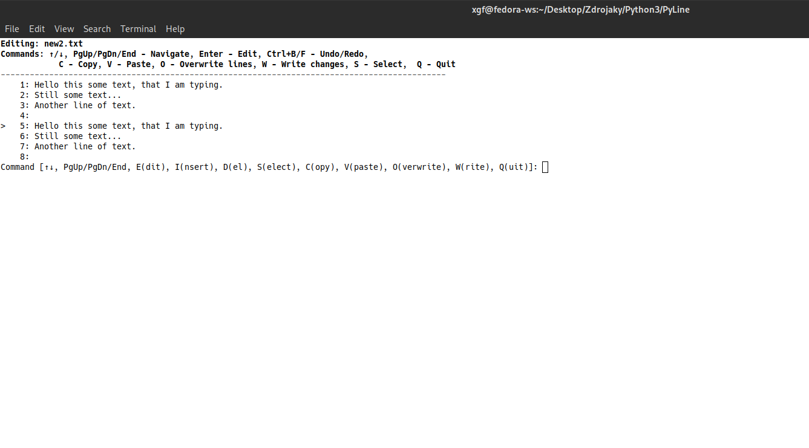

# PyLine - Lightweight Terminal Text Editor

 

PyLine is a minimalist command-line text editor designed for Linux/BSD systems, written in Python 3 with use of systems calls. Originally created in 2018 and modernized in 2025, it combines improved text management with a simple, line-by-line workflow. 
(*Note: This is a hobby project, not a professional application.*)

## Features

For now, editor use color scheme of your terminal and only coloring happens in python syntax.

- **Lightweight & Fast**: Runs entirely in terminal with minimal dependencies
- **Advanced Hook System**: Extensible plugin architecture with support for multiple languages (Python, JavaScript, Perl, Ruby, Lua, PHP, Shell)
- **File Operations**:
  - Edit existing files with full hook integration
  - Create new files with directory structure creation
  - Truncate existing files
  - Count words, lines and characters with hookable word counting
- **Navigation**:
  - Move between lines and scroll file with arrow keys
  - Scroll file by keys PageUp and PageDown
  - Jump to end of file (Ctrl+D for EOF)
  - Smart viewport management
- **Editing**:
  - Line-by-line editing with hook-integrated input handling
  - Preserves existing text when modifying lines
  - Insert/delete line operations with pre/post hooks
  - Comprehensive Undo/Redo system (history limit set to 120)
  - Multi-line text selection with visual indicators
  - Cross-platform clipboard support (X11, Wayland, macOS, Windows)
  - Smart indentation preservation during paste operations
  - Syntax highlighting for Python with advanced token recognition
- **File Browser**:
  - Colorized directory listings
  - Change working directories with path persistence
  - Make new directories
  - Remove files and directories
  - Rename files and directories
- **Hook Management**:
  - Visual hook manager interface (`hm` command)
  - Priority-based hook execution (90 → 10)
  - Runtime enable/disable without restart
  - Support for multiple scripting languages
  - Hook categories: input handlers, event handlers, syntax handlers, editing operations, clipboard operations, session handlers

## Example screens

PyLine after the initialization:  
 

Open file option screen:  


Example of line selection:  


After pasting the selection from clipboard:

  
Execmode(Filemanager):  

  
Hook manager:  

  


## Installation

1st method: Manual run
```bash
git clone https://github.com/Peter-L-SVK/PyLine.git
cd PyLine/src/
chmod +x main.py
```
2nd method (script will run sudo command):
```bash
git clone https://github.com/Peter-L-SVK/PyLine.git
cd PyLine/
./install.sh
```

## Usage

In case of manual run:
```bash
./main.py
```

If you used install script:
```bash
pyline  #works from anywhere
```
Editor accpets input arguments:
```bash
# Edit existing file
./main.py existing_file.txt # pyline existing_file.txt

# Create new file
./main.py new_file.txt  # pyline new_file.txt
```

The editor will:
1. For existing files:
   - Load the file
   - Enter edit mode immediately
2. For new files:
   - Create new buffer with specified filename
   - Create new directory in file path if doesn't exist already
   - Enter edit mode
3. With no arguments:
   - Show the original interactive menu

4. -i, --info   Show program information and exit

5. -h, --help   show help message and exit

To unninstall the program:
```bash
./install.sh -u
```
## Core Hook System Structure with all possible features and hooks in mind
**Advanced Hook System**

PyLine features a comprehensive hook system that allows extending functionality through plugins. The hook system supports multiple programming languages and follows a structured directory hierarchy:

```
~/.pyline/hooks/
├── input_handlers/           # Input processing hooks
│   └── edit_line/           # Line editing handlers
│       ├── smart_tab__90.py  # Priority 90 (high)
│       └── auto_complete.py
├── event_handlers/           # Event-based hooks  
│   ├── pre_save/            # Before saving
│   ├── post_save/           # After saving
│   ├── pre_load/            # Before loading
│   ├── post_load/           # After loading
│   └── on_error/            # Error handling
├── syntax_handlers/         # Syntax processing
│   ├── highlight/           # Syntax highlighting
│   └── lint/               # Code linting
├── editing_ops/            # Editing operations
│   ├── pre_insert/         # Before line insertion
│   ├── post_insert/        # After line insertion  
│   ├── pre_delete/         # Before line deletion
│   └── post_delete/        # After line deletion
├── clipboard_ops/          # Clipboard operations
│   ├── pre_copy/           # Before copying
│   ├── post_copy/          # After copying
│   ├── pre_paste/          # Before pasting
│   └── post_paste/         # After pasting
└── session_handlers/       # Session management
    ├── pre_edit/          # Before editing session
    └── post_edit/         # After editing session
```

### Editor Menu

|Command|Action|
|---|---|
|`1`|Edit existing file|
|`2`|Create new file|
|`3`|Truncate existing or create new file|
|`cls`|Clear screen|
|`cw`|Count words in the file|
|`hm`|Hook manager|
|`hs`|Hook status|
|`x`|Enter file management mode (exec mode)|
|`i`|Info|
|`q`|Exit program|
|`Ctrl+D`|Escape from function|
|`Ctrl+C`|Interupt the program|

**Hook Management Commands:**
- `hm` - Enter hook manager interface
- `ls` - List all available hooks
- `info` - Show detailed hook information
- `enable` - Enable a specific hook
- `disable` - Disable a specific hook
- `reload` - Reload hook system from filesystem

### Editor Controls
|Command|Action|
|---|---|
|`↑`/`↓`|Navigate between lines / Scroll by lines|
| `PgUp` / `PgDn` | Scroll by 52 lines buffer|
|`Ctrl+B` / `F` | Undo/Redo 
|`Enter`/`e`|Edit current line|
|`i`|Insert new line|
|`d`|Delete current line or multiple selected|
|`c`|Copy current line or multiple selected|
|`v`|Paste from clipboard|
|`o`|Overwrite lines|
|`s`|Start / End of selection|
|`q` /`esc`|Quit editor|
|`w`|Write changes|
|`Ctrl+D` / `End`|Jump to end of file|

### File Management Mode

|Command|Action|
|---|---|
|`af`|List all files|
|`cwd`|Change working directory|
|`cdp`|Change the default path|
|`mkdir`|Create new directory|
|`rename`|Rename a file/directory|
|`rmdir`|Remove a non empty/empty directory|
|`rmfile`|Remove a file|
|`cls`|Clear screen|
|`q`|Exit file management|
|`Ctrl+D`|Escape from function|

## Requirements

- **Hook Language Support**:
  - Python: Built-in
  - JavaScript: `node` runtime
  - Perl: `perl` interpreter
  - Ruby: `ruby` interpreter
  - Lua: `lua` interpreter
  - PHP: `php` interpreter
  - Shell: `bash` or `zsh` interpreter
- Python 3.6+   
- Linux(or WSL)/FreeBSD/MacOS system (tested on Fedora 27 MATE, 40/42 Cinnmanon)
- Bash or Zsh shell
- Clipboard: xclip (X11) or wl-clipboard (Wayland) for copy/paste (Comes with GUI/DE)
## License

GNU GPL v3 - See [LICENSE](https://www.gnu.org/licenses/gpl-3.0.html) file for details.

## Testing

To run all tests:

```bash
cd PyLine/tests/
python -m unittest discover
```

Or run a specific test file:

```bash
python -m unittest test_dirops.py
```

All tests require only Python’s built-in `unittest` module.

## Contributing

Contributions are welcome!  
See [CONTRIBUTING](https://github.com/Peter-L-SVK/PyLine/blob/main/CONTRIBUTING.md) file for details.  

For contact please see my email in profile info or use GitHub’s built-in communication tools.

Please open an issue or pull request for any:  

- Bug fixes
    
- Feature suggestions
    
- Documentation improvements
    

---

_Created by Peter Leukanič in 2018 - A simple editor for when you need to edit text files quickly without leaving the terminal._
