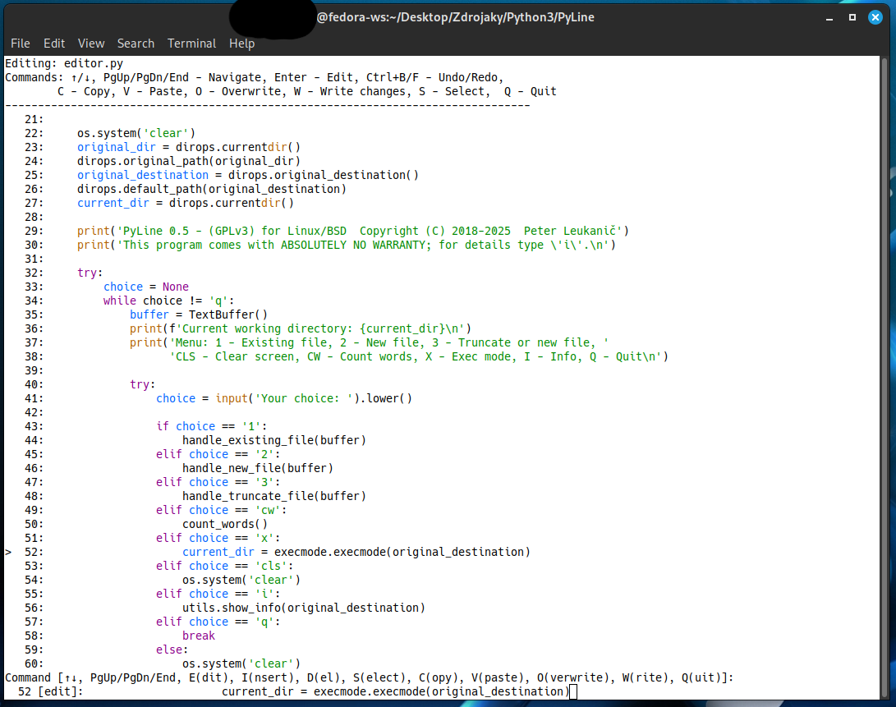

# PyLine - Lightweight Terminal Text Editor

 

PyLine is a minimalist command-line text editor designed for Linux/BSD systems, written in Python 3 and borrowing BASH calls. Originally created in 2018, it has been modernized with improved text buffer management while maintaining its simple, line by line workflow. 

## Features

- **Lightweight & Fast**: Runs entirely in terminal with minimal dependencies
- **File Operations**:
  - Edit existing files
  - Create new files
  - Truncate existing files
- **Navigation**:
  - Move between lines with arrow keys
  - Jump to start/end of file (Ctrl+D for EOF)
- **Editing**:
  - Line-by-line editing with syntax
  - Preserves existing text when modifying lines
  - Insert/delete line operations
- **File Browser**:
  - List directory contents
  - Change working directories
- **Cross-Platform**: Works on Linux and BSD systems

## Installation

```bash
git clone https://github.com/yourusername/pyline.git
cd pyline
chmod +x editor.py
```


## Usage

```bash
./editor.py
```
### Editor Controls

|Command|Action|
|---|---|
|`1`|Edit existing file|
|`2`|Create new file|
|`3`|Truncate/create file|
|`↑`/`↓`|Navigate between lines|
|`Enter`/`e`|Edit current line|
|`i`|Insert new line|
|`d`|Delete current line|
|`s`|Save file|
|`q`|Quit editor|
|`Ctrl+D`|Jump to end of file|
|`x`|Enter file management mode (exec mode)|

### File Management Mode

|Command|Action|
|---|---|
|`af`|List all files|
|`cwd`|Change working directory|
|`cdp`|Change the default path|
|`mkdir`|Create new directory|
|`cls`|Clear screen|
|`q`|Exit file management|

## Requirements

- Python 3.6+   
- Linux/BSD system (tested on Fedora 27 and later on Fedora 40)
- Bash shell

## License

GNU GPL v3 - See [LICENSE](https://license/) file for details.

## Contributing

Contributions are welcome! Please open an issue or pull request for any:

- Bug fixes
    
- Feature suggestions
    
- Documentation improvements
    

---

_Created by Peter Leukanič in 2018 - A simple editor for when you need to edit text files quickly without leaving the terminal._
