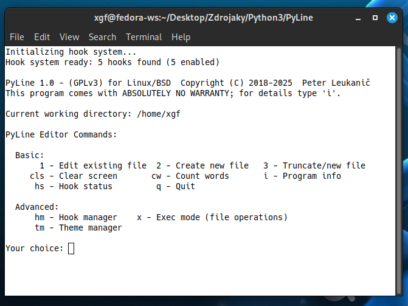
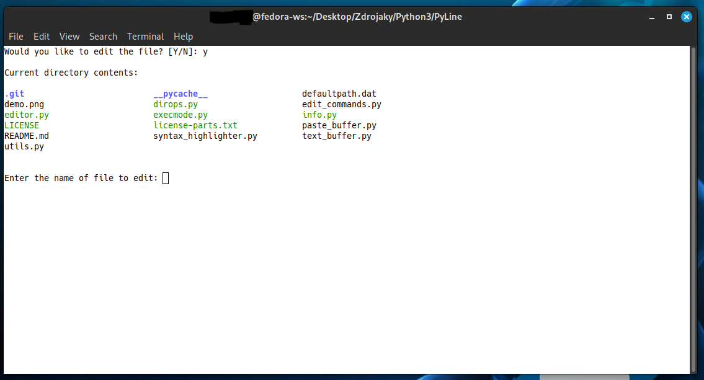
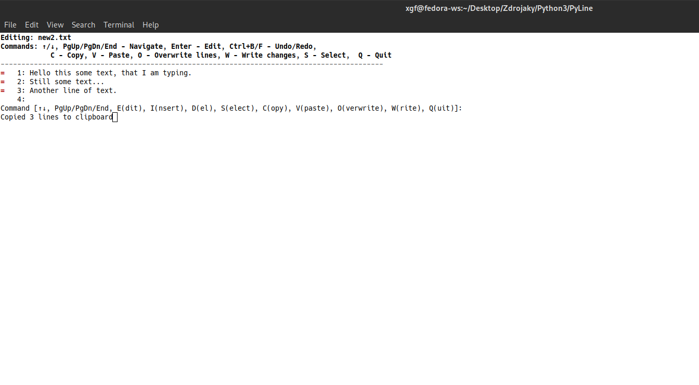
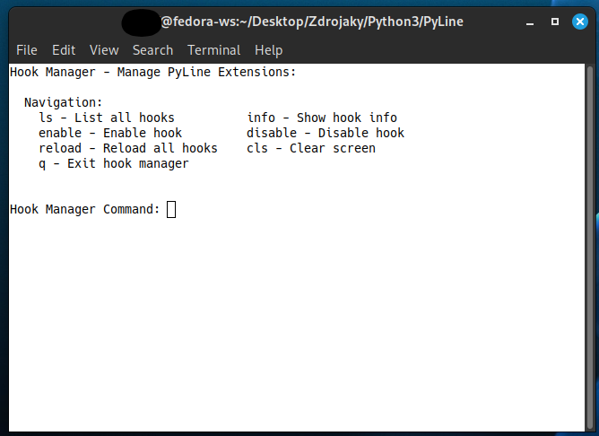
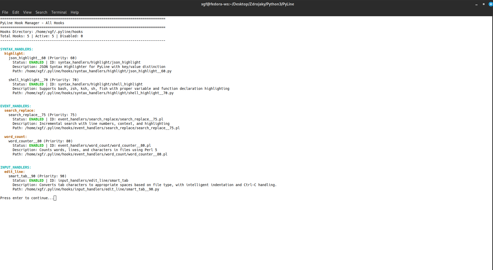

# PyLine Editor - Visual Showcase

A comprehensive terminal-based line editor with advanced features and extensible hook system.

## 🖥️ Main Interface

*Clean startup interface with hook system initialization and main menu*

## 📁 File Operations

### File Selection

*Interactive file browser for selecting files to edit*

### Execution Mode

*File operations mode with navigation and management commands*

## ✏️ Editing Features

### Basic Text Editing

*Main editing interface with comprehensive command set*

### Copy & Paste Operations

*Multi-line copy and paste functionality with visual feedback*

*Helpscreen after pressing H*

## 🔍 Search & Replace

### Replace Operations

*Search and replace with preview and confirmation*

### Search Interface

*Incremental search with real-time highlighting*

### Search Results

*Organized search results with match counts and line numbers*

### Advanced Search

*Complex search patterns with extensive result display*

## 🎨 Theme System

### Theme Management

*Complete theme management with create, edit, and switch capabilities*

### Theme Editing

*Direct theme file editing with JSON configuration*

### Theme Information

*Detailed theme color scheme display and testing*

## 🔧 Hook System

### Hook Manager

*Centralized hook management interface*

### Hook Listing

*Interactive hook listing with detailed information*

### Hook Details

*Comprehensive hook information with status and descriptions*

## 📊 Syntax Highlighting

### JSON Support

*Advanced JSON syntax highlighting with proper formatting*

### Python Support

*Advanced Python syntax highlighting with proper formatting*
### Shell Support

*Advanced Bash syntax highlighting with proper formatting*

---

*All screenshots taken from actual PyLine v1.0 sessions running on Fedora Linux*
